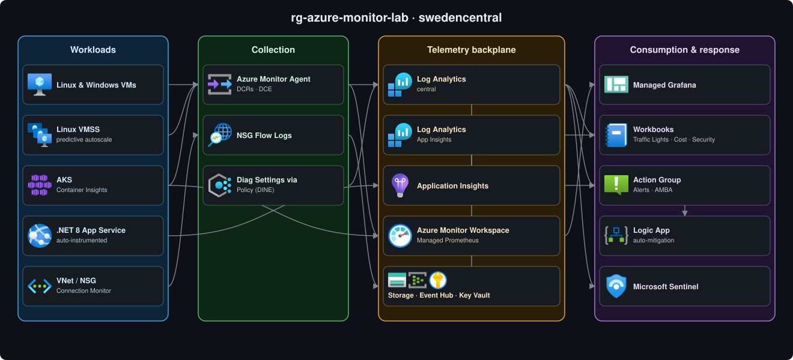

# Azure Monitor Demo Lab

A self-contained demo of the Azure Monitor and Microsoft Sentinel stack. Everything runs from a single config file that stays out of git, so you can stand the whole thing up in your own subscription and tear it back down when you're finished.

- One resource group: the whole lab lands in `rg-azure-monitor-lab`.
- Two ways to deploy it: Bicep or Terraform.
- Two ways to run it: one-shot for a quick internal demo, or a 5-stage workshop if you'd rather walk through it piece by piece.
- 53 demo scenarios that cover Azure Monitor and Sentinel from end to end.

It's built for demos, microhacks, and hackathons. Deploy it, poke around, break it, restore it, and tear it down.

## Architecture

Everything lands in a single resource group (`rg-azure-monitor-lab`), with telemetry flowing from left to right:

1. Workloads emit signals.
2. Agents and policies collect them.
3. The telemetry backplane stores them.
4. The consumption layer turns them into dashboards, alerts, and responses.

There's also an optional GenAI workload (off by default) that plugs into the same backbone:

- What it adds: a Microsoft Foundry account and project with chat, embedding, optimization, and model-router deployments, plus a few agents and a traffic simulator.
- How it's observed: token, trace, and cost telemetry flows into Application Insights, which drives token anomaly and spike alerts and an AI FinOps query pack and workbook, and adds an AI tier to the workload health model.

[](docs/architecture.drawio)

> 🎨 Full Azure-icon diagram (editable): [docs/architecture.drawio](docs/architecture.drawio). Open it with [diagrams.net](https://app.diagrams.net) or the VS Code *Draw.io Integration* extension. It has a per-tier overview plus a detail page for each pillar, including a dedicated AI / GenAI page.

> 📦 For a full, resource-by-resource list of what gets created, see [REFERENCE.md → What gets deployed](docs/REFERENCE.md#what-gets-deployed).

## Prerequisites

- Azure CLI (`az`) 2.60 or later, logged in with `az login`
- `kubectl` (any recent version)
- Bicep CLI (bundled with `az` 2.20+), or Terraform 1.6+ if you take the Terraform path
- PowerShell 7+
- A subscription with quota for ~5 small VMs/nodes (`Standard_B2s`), 1 App Service B1, Managed Grafana, Storage, Event Hub, and Key Vault
- For the optional AI stage only: Python 3.10+. `scripts/setup-ai.ps1` provisions the demo agents and traffic simulator from [`workloads/ai/`](workloads/ai/), and the models it deploys are billable.

> Two IaC paths, one config. Bicep is the primary one (`infra/`); Terraform (`terraform/`) is a parallel implementation driven from the same `lab.config.json`. Pick one and don't mix them.

## Deploy

> Recommended region: `northeurope` (the default), which has the widest feature availability. A few things pin themselves to a fixed region no matter what you pick: the Health Model preview and the optional GenAI / AI stage (Microsoft Foundry and its models) go to `swedencentral` (they aren't available in `northeurope`), and the App Service goes to `westeurope` (the sponsored lab subscriptions have no Basic App Service quota in `northeurope`). Everything else follows the region you choose.

### Option 1: Deploy to Azure (portal, no local setup)

<div align="center">

[](https://portal.azure.com/#create/Microsoft.Template/uri/https%3A%2F%2Fraw.githubusercontent.com%2Fclaestom%2Fazure-monitor-demo-lab%2Fmaster%2Finfra%2Fmain.json/createUIDefinitionUri/https%3A%2F%2Fraw.githubusercontent.com%2Fclaestom%2Fazure-monitor-demo-lab%2Fmaster%2Finfra%2FcreateUiDefinition.json)

</div>

Opens a guided Custom deployment wizard in the Azure Portal, where you enter every value in the UI and don't need any local files. Sensible defaults are pre-filled throughout; the only things you have to supply are an alert email and a VM admin password.

| Tab | You provide |
|---|---|
| **Basics** | Resource group (recommended `rg-azure-monitor-lab`), Region (recommended `northeurope`), name prefix, alert email, VM admin username + password |
| **Workloads** | Deploy Linux/Windows VMs, VM size, AKS node size + count |
| **Monitoring & cost** | Daily ingestion cap, Sentinel, platform-logs/metrics-export DCRs, LAW replication |
| **Advanced** | Owner tag, App Service sample repo, optional SIEM/Teams webhook |

> Use Option 2 if you prefer Infrastructure-as-Code, the staged workshop, or the subscription guardrail.

### Option 2: Scripted (Bicep / Terraform, full control)

This repo ships no secrets. You fill in one central config file, and `sync-config.ps1` generates every derived input from it.

```powershell
# 1. Clone the repo and enter it
git clone https://github.com/claestom/azure-monitor-demo-lab.git
cd azure-monitor-demo-lab

# 2. Copy the template and fill in subscriptionId, tenantId, alertEmail, vmAdminPassword, ...
Copy-Item lab.config.json.example lab.config.json
notepad lab.config.json
#    → edit the values, then save the file (Ctrl+S) and close Notepad before continuing

# 3. Deploy (deploy.ps1 calls sync-config.ps1 for you)
./scripts/deploy.ps1

# Or target a custom resource group / region (created if it doesn't exist yet):
./scripts/deploy.ps1 -ResourceGroup rg-my-lab -Location westeurope
```

Defaults: resource group `rg-azure-monitor-lab`, region `northeurope`. Override them with `-ResourceGroup` / `-Location` (explicit args win over `lab.config.json`, which in turn wins over these defaults). The group is created if it doesn't exist yet, or reused if it does. The whole run takes about 20 to 25 minutes. See [REFERENCE.md → Deploy](docs/REFERENCE.md#deploy) for the config details and the subscription guardrail.

<details>
<summary><b>Pre-flight check</b> (region SKU / quota validation before deploy)</summary>

Before creating anything, `deploy.ps1` runs [`scripts/preflight-check.ps1`](scripts/preflight-check.ps1), which checks in about 15 seconds that every VM SKU, vCPU quota, and PaaS resource type the lab needs is actually available in the region you picked for your subscription. It fails fast with a PASS/WARN/FAIL table instead of blowing up 20 minutes into the deployment. You can run it on its own to vet a region before committing (`./scripts/preflight-check.ps1 -Location westeurope`), or skip it with `./scripts/deploy.ps1 -SkipPreflight`.

The pre-flight checks *availability and quota*, not *live service capacity*. Transient, region-wide shortages like AKS `AksCapacityHeavyUsage` have no pre-check API and only surface at deploy time. If one hits, `deploy.ps1` catches it and points you to the fix: deploy to another region (`-Location northeurope`) or retry (`-MaxDeployRetries 3`), since capacity frees up as other clusters are deleted.

</details>

Two delivery modes:

- One-shot: `./scripts/deploy.ps1` deploys everything at once. It's the fastest option and fine for internal demos.
- Staged workshop: 5 stages (A to E) that you can pause between, toggled in `lab.config.json`. Step-by-step guides: [Bicep](docs/DEPLOY-BICEP-STEP-BY-STEP.md) · [Terraform](docs/DEPLOY-TERRAFORM-STEP-BY-STEP.md).

> Optional AI stage. An extra stage (off by default) adds a Microsoft Foundry GenAI workload (pinned to `swedencentral`) that emits token, trace, and cost telemetry, plus token-spike alerts and an AI FinOps query pack and workbook. Turn it on with `stageToggles.enableStageAI` (Bicep one-shot) or Terraform's `enable_stage_ai`, then run `./scripts/setup-ai.ps1` to create the demo agents and simulate traffic. Check the Model Router version for your region first (`az cognitiveservices account list-models`).

When you're done (the 1 GB/day cost guardrails are baked in either way):

```powershell
./scripts/teardown.ps1 -Yes   # deletes the whole resource group
```

## Documentation

| Doc | What's in it |
|---|---|
| [REFERENCE.md](docs/REFERENCE.md) | Full capability matrix · every deployed resource · demo walkthrough · cost breakdown · folder layout · optional add-ons · troubleshooting |
| [DEMO-SCENARIOS.md](docs/DEMO-SCENARIOS.md) | All 53 demo scenarios, each with a story, a click-path, and a "killer line", plus audience-pivoted shortlists |
| [docs/DEPLOY-BICEP-STEP-BY-STEP.md](docs/DEPLOY-BICEP-STEP-BY-STEP.md) · [docs/DEPLOY-TERRAFORM-STEP-BY-STEP.md](docs/DEPLOY-TERRAFORM-STEP-BY-STEP.md) | Staged deployment tutorials |
| Stage notes: [A](docs/STAGE-A-FOUNDATION.md) · [B](docs/STAGE-B-WORKLOADS.md) · [C](docs/STAGE-C-ALERTING.md) · [D](docs/STAGE-D-SECURITY-POSTURE.md) · [E](docs/STAGE-E-OPTIONAL-ADVANCED.md) · [AI](docs/STAGE-AI.md) | Per-stage speaker notes (incl. the optional GenAI / AI FinOps stage) |
| [docs/CUSTOMER-STAGE-HANDOUT.md](docs/CUSTOMER-STAGE-HANDOUT.md) | Per-stage time + cost cheat sheet |

## Contributing & license

Contributions are welcome. See [CONTRIBUTING.md](.github/CONTRIBUTING.md) and the [Code of Conduct](.github/CODE_OF_CONDUCT.md). To report a security issue, see [SECURITY.md](.github/SECURITY.md).

Licensed under the [MIT License](LICENSE): free to use, modify, and redistribute (including for microhacks, hackathons, and your own demos), and provided as-is without warranty.
