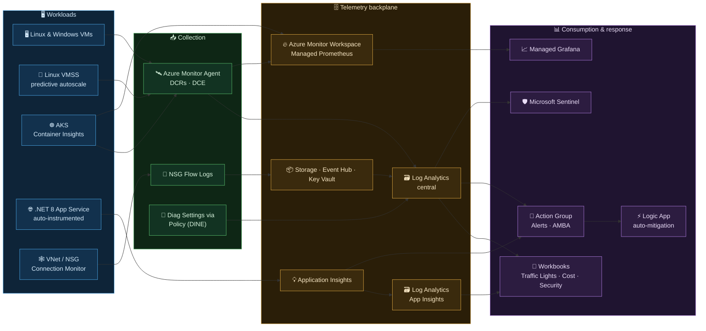

# Azure Monitor Demo Lab

A self-contained, reproducible demo of the **Azure Monitor + Microsoft Sentinel** stack. One resource group, two IaC paths (Bicep or Terraform), two delivery modes (**one-shot** for internal demos or a **5-stage workshop** for progressive enablement), and **52 demo scenarios** — all driven from a single, gitignored config file.

Built for **demos, microhacks, and hackathons**: deploy it into your own subscription, explore Azure Monitor end-to-end, break it, restore it, and tear it down.

## What's inside

One resource group, wired end-to-end across the observability stack:

| Layer | What you get |
| --- | --- |
| **Workloads** | Linux/Windows VMs, AKS, Linux VMSS (predictive autoscale), .NET 8 App Service |
| **Workload monitoring** | VM Insights, Container Insights, Managed Prometheus, Grafana, OpenTelemetry, codeless App Service auto-instrumentation |
| **Telemetry backbone** | 2 × Log Analytics, Application Insights, Azure Monitor Workspace (Managed Prometheus), DCRs with ingest-time transforms |
| **Governance** | Diagnostic Settings via DeployIfNotExists policy, cross-workspace KQL, reusable KQL functions |
| **Networking** | Connection Monitor, NSG Flow Logs + Traffic Analytics, Network Insights |
| **Alerting & response** | Action Group, 7+ metric/KQL/activity/dynamic-threshold alerts, AMBA, alert processing rules, Logic App auto-mitigation |
| **Security** | Microsoft Sentinel onboarding, security-posture alert rules, granular workspace/table/row RBAC |
| **Cost & data routing** | Daily caps, Basic/Analytics table plans, Summary Rules, Data Export, cost workbook |
| **Reliability previews** | Service Groups + Health Models, SLIs/SLOs, Search Jobs + archive restore |

> Full resource-by-resource list: **[REFERENCE.md → What gets deployed](REFERENCE.md#what-gets-deployed)**.

## Architecture

Everything below lands in a **single resource group** (`rg-azure-monitor-lab`). Telemetry flows left-to-right: workloads emit signals, agents/policies collect them, the backplane stores them, and the consumption layer turns them into dashboards, alerts, and responses.

[](docs/architecture.drawio)

<details>
<summary>Text / emoji version (Mermaid)</summary>



</details>

> 🎨 **Full Azure-icon diagram (editable):** [docs/architecture.drawio](docs/architecture.drawio) — open with [diagrams.net](https://app.diagrams.net) or the VS Code *Draw.io Integration* extension. It contains a per-tier overview plus detail pages for each pillar.

## Prerequisites

- Azure CLI (`az`) ≥ 2.60, logged in: `az login`
- `kubectl` (any recent version)
- Bicep CLI (bundled with `az` ≥ 2.20) — **or** Terraform ≥ 1.6 for the Terraform path
- PowerShell 7+
- A subscription with quota for ~5 small VMs/nodes (`Standard_B2s`), 1 App Service B1, Managed Grafana, Storage, Event Hub, Key Vault.

> **Two IaC paths, one config.** Bicep is primary (`infra/`); Terraform (`terraform/`) is a parallel implementation driven from the same `lab.config.json`. Pick one — don't mix.

## Deploy

### Option 1 — Deploy to Azure (portal, no local setup)

<div align="center">

[](https://portal.azure.com/#create/Microsoft.Template/uri/https%3A%2F%2Fraw.githubusercontent.com%2Fclaestom%2Fazure-monitor-demo-lab%2Fmaster%2Finfra%2Fmain.json/createUIDefinitionUri/https%3A%2F%2Fraw.githubusercontent.com%2Fclaestom%2Fazure-monitor-demo-lab%2Fmaster%2Finfra%2FcreateUiDefinition.json)

</div>

Opens a guided **Custom deployment** wizard in the Azure Portal — **every value is entered in the UI, no local files needed**. Sensible defaults are pre-filled throughout; you only *must* supply an **alert email** and a **VM admin password**.

| Tab | You provide |
|---|---|
| **Basics** | Resource group (recommended `rg-azure-monitor-lab`), Region (recommended `swedencentral`), name prefix, alert email, VM admin username + password |
| **Workloads** | Deploy Linux/Windows VMs, VM size, AKS node size + count |
| **Monitoring & cost** | Daily ingestion cap, Sentinel, platform-logs/metrics-export DCRs, LAW replication |
| **Advanced** | Owner tag, App Service sample repo, optional SIEM/Teams webhook |

> Use **Option 2** if you prefer Infrastructure-as-Code, the staged workshop, or the subscription guardrail.

### Option 2 — Scripted (Bicep / Terraform, full control)

This repo ships **zero secrets**. Populate one central config file; `sync-config.ps1` generates every derived input from it.

```powershell
# 1. Copy the template and fill in subscriptionId, tenantId, alertEmail, vmAdminPassword, ...
Copy-Item lab.config.json.example lab.config.json
notepad lab.config.json

# 2. Deploy (deploy.ps1 calls sync-config.ps1 for you)
./scripts/deploy.ps1

# Or target a custom resource group / region (created if it doesn't exist yet):
./scripts/deploy.ps1 -ResourceGroup rg-my-lab -Location westeurope
```

Defaults: resource group `rg-azure-monitor-lab`, region `swedencentral`. Override with `-ResourceGroup` / `-Location` (explicit args win over `lab.config.json`, which wins over these defaults). The group is created if it doesn't already exist, or reused if it does. End-to-end ~20–25 minutes. See [REFERENCE.md → Deploy](REFERENCE.md#deploy) for the config details and the subscription guardrail.

> **Pre-flight check.** Before creating anything, `deploy.ps1` runs [`scripts/preflight-check.ps1`](scripts/preflight-check.ps1), which validates — in ~15 seconds — that every VM SKU, vCPU quota, and PaaS resource type the lab needs is actually available in the selected region for your subscription. It fails fast with a PASS/WARN/FAIL table instead of blowing up 20 minutes into the deployment. Run it standalone to vet a region before committing (`./scripts/preflight-check.ps1 -Location westeurope`), or bypass with `./scripts/deploy.ps1 -SkipPreflight`.
>
> The pre-flight validates *availability + quota*, not *live service capacity*. Transient, region-wide shortages such as AKS `AksCapacityHeavyUsage` have no pre-check API and can only surface at deploy time. If one hits, `deploy.ps1` detects it and points you to the fix — deploy to another region (`-Location northeurope`) or retry (`-MaxDeployRetries 3`), since capacity is reclaimed as other clusters are deleted.

**Two delivery modes:**

- **One-shot** — `./scripts/deploy.ps1` deploys everything at once (fastest, internal demos).
- **Staged workshop** — 5 progressive stages (A–E) you can pause between, toggled in `lab.config.json`. Step-by-step guides: [Bicep](docs/DEPLOY-BICEP-STEP-BY-STEP.md) · [Terraform](docs/DEPLOY-TERRAFORM-STEP-BY-STEP.md).

When you're done (cost guardrails of 1 GB/day are baked in either way):

```powershell
./scripts/teardown.ps1 -Yes   # deletes the whole resource group
```

## Documentation

| Doc | What's in it |
|---|---|
| [REFERENCE.md](REFERENCE.md) | Full capability matrix · every deployed resource · demo walkthrough · cost breakdown · folder layout · optional add-ons · troubleshooting |
| [DEMO-SCENARIOS.md](DEMO-SCENARIOS.md) | All 52 demo scenarios — story, click-path, and "killer line", plus audience-pivoted shortlists |
| [docs/DEPLOY-BICEP-STEP-BY-STEP.md](docs/DEPLOY-BICEP-STEP-BY-STEP.md) · [docs/DEPLOY-TERRAFORM-STEP-BY-STEP.md](docs/DEPLOY-TERRAFORM-STEP-BY-STEP.md) | Staged deployment tutorials |
| Stage notes: [A](docs/STAGE-A-FOUNDATION.md) · [B](docs/STAGE-B-WORKLOADS.md) · [C](docs/STAGE-C-ALERTING.md) · [D](docs/STAGE-D-SECURITY-POSTURE.md) · [E](docs/STAGE-E-OPTIONAL-ADVANCED.md) | Per-stage speaker notes |
| [docs/CUSTOMER-STAGE-HANDOUT.md](docs/CUSTOMER-STAGE-HANDOUT.md) | Per-stage time + cost cheat sheet |

## Contributing & license

Contributions are welcome — see [CONTRIBUTING.md](CONTRIBUTING.md) and the [Code of Conduct](CODE_OF_CONDUCT.md). To report a security issue, see [SECURITY.md](SECURITY.md).

Licensed under the **[MIT License](LICENSE)** — free to use, modify, and redistribute (including for microhacks, hackathons, and your own demos), provided as-is without warranty.
