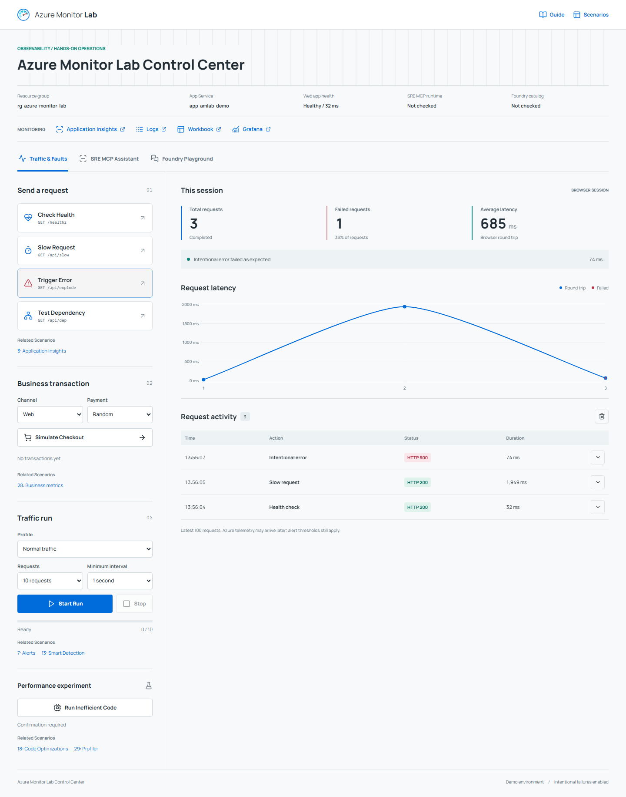

# Azure Monitor Lab Control Center

The Control Center is the operational interface for the Azure Monitor Lab: generate application traffic, try the existing Foundry agents, and use direct SRE MCP management tools from the deployed web app. It brings those activities together without replacing the Azure portal or the lab's [guided scenarios](DEMO-SCENARIOS.md).

The screenshot uses example resource names and local test traffic. It is not a live health report.

## Choose Your Starting Point

| Experience | Start here |
|---|---|
| Guided Scenarios | Follow [Demo Scenarios](DEMO-SCENARIOS.md) for the story, prerequisites, portal steps, queries, and expected observations. All existing workflows remain available. |
| Lab Control Center | Open the deployed application to generate activity and interact with the configured agents. Use Related Scenarios links to continue the relevant walkthrough. |

## Open The Application

1. Deploy the lab and complete the [post-deployment steps](POST-DEPLOYMENT.md) for your deployment method. The portal template provisions infrastructure; its Cloud Shell follow-up publishes the application.
2. In the Azure portal, open the lab resource group, select its **App Service**, and choose **Browse**. The app opens at `/` with **Traffic & Faults** selected.
3. Check the resource group and App Service shown in the environment strip before sending traffic or approving an operation.
4. For **Foundry Playground** or **SRE MCP Assistant**, select **Sign In** with an approved lab operator account when prompted. These optional capabilities must have their resources, authentication, and permissions configured first.

The Control Center runs in the lab's existing App Service. It is not a separate Azure resource or a replacement for the Azure Resource Manager control plane. For local use, see the [web app developer guide](../workloads/webapp/README.md#run-locally).

## Workspaces

| Tab | Available activities | Requirements |
|---|---|---|
| Traffic & Faults | Health checks, deliberately slow requests and errors, dependency calls, checkout outcomes, bounded traffic runs, and a confirmation-gated performance experiment. Inspect request history, latency, and trace IDs. | The published lab web app. The optional AI and SRE stages are not required. |
| Foundry Playground | Run an approved task against an existing lab agent. Inspect its response, reported model, token usage, run ID, and application trace. | Existing Foundry project and supported agents, enabled backend access, and an approved signed-in operator. |
| SRE MCP Assistant | Ask questions about configured SRE resources and use allowed management tools. Review exact tool arguments before approving a change and inspect the operation log afterward. | Existing SRE Agent, native MCP runtime, a configured host model, scoped backend permissions, and an approved signed-in operator. |

The SRE MCP Assistant does **not** create SRE investigation threads or run autonomous investigations. Its host model selects direct MCP tools. The investigation scenarios remain separate workflows in the SRE portal. Foundry tasks continue to use their existing temporary Foundry threads; that is a different service and workflow.

## Connection Status

The environment strip remains visible across tabs. Statuses reflect the most recent requested check, not continuous monitoring:

- **Resource group / App Service:** deployment context supplied by the backend, not an environment selector.
- **Web app health:** the last explicit health-check result for this application, not the health of the whole lab.
- **SRE MCP runtime:** checked when its tab opens or its connection is refreshed. Runtime connected means MCP tool discovery succeeded; it does not prove every Azure permission or model call will succeed.
- **Foundry catalog:** checked when its tab opens or its availability is refreshed. An available-agent count means discovery succeeded, not that a task has run.
- **Not checked, Sign-in required, or Unavailable:** no successful check has established availability. Use the status details in the corresponding tab before continuing.

Opening tabs checks availability only; model execution still requires usage consent. Missing services are not provisioned by opening the Control Center.

## From Controls To Scenarios

| Control Center activity | Guided scenario | What to observe |
|---|---|---|
| Health, slow, error, and dependency requests | [3: Application Insights](DEMO-SCENARIOS.md#s3) | Server requests, failures, dependencies, and correlated traces. |
| Checkout and payment outcomes | [28: Custom metrics and events](DEMO-SCENARIOS.md#s28) | Business telemetry and checkout outcomes. |
| Controlled traffic and error bursts | [7: Alerts](DEMO-SCENARIOS.md#s7), [13: Smart Detection](DEMO-SCENARIOS.md#s13) | The relationship between generated activity, telemetry, and detection. Follow the scenario's dedicated ramp or threshold requirements where needed. |
| Performance experiment | [18: Code Optimizations](DEMO-SCENARIOS.md#s18), [29: Profiler and Snapshot Debugger](DEMO-SCENARIOS.md#s29) | Profiling and diagnostic evidence after the required traffic and collection interval. |
| Foundry agent tasks | [53: AI FinOps](DEMO-SCENARIOS.md#s53) | Reported model usage, traces, and cost analysis; use the scenario's setup for its full workload. |
| SRE resource, connector, and readiness questions | [54: SRE Agent readiness](DEMO-SCENARIOS.md#s54) | Agent configuration and access prerequisites, without automatically starting an investigation. |
| Open the Workbook or Grafana destination | [1: Traffic-Lights Workbook](DEMO-SCENARIOS.md#s1), [4: Kubernetes and Grafana](DEMO-SCENARIOS.md#s4) | The broader monitoring views in Azure. The Control Center does not replace those dashboards. |

Related Scenarios links are navigation, not execution shortcuts. The [scenario catalog](DEMO-SCENARIOS.md) remains the source of truth for prerequisites and complete click-paths. Browser traffic alone does not guarantee an alert, a Smart Detection incident, or a profiler recommendation; ingestion, sampling, thresholds, and collection time still apply.

## Safety And Access

- Traffic targets the deployed demo application. Errors and delays are intentional; the performance experiment can affect other users of that app. Browser runs are capped at 30 requests, and Stop prevents subsequent requests rather than undoing work already sent.
- Browser request counts describe this session, not all lab traffic. Clearing results does not delete Azure telemetry.
- Agent tabs require explicit enablement and, when hosted, operator-restricted App Service Authentication. Backend service calls use the app's managed identity, not delegated permissions from each browser user.
- Foundry tasks and MCP host-model questions require usage consent. Existing model charges apply. Do not submit secrets or sensitive data.
- MCP writes require a separate, expiring approval of the exact tool and arguments. A lost or timed-out response can leave the operation outcome unknown; check Azure before repeating it. Stop Waiting is not a guarantee of cancellation.
- No new subscriptions, environments, roles, or agent resources are created by this navigation update. The existing API contracts and approval gates are unchanged.

## Setup And Reference

- [Lab deployment options](../README.md#deploy) and [post-deployment steps](POST-DEPLOYMENT.md).
- [Foundry access and developer reference](../workloads/webapp/README.md#enable-foundry-access).
- [SRE MCP configuration, permissions, limits, and recovery](../workloads/webapp/SRE-MCP.md).
- [Complete guided scenarios](DEMO-SCENARIOS.md).

The app's Guide and Scenarios links target the published `master` documentation. When previewing an unmerged feature branch, read this guide from that branch until it is merged. No Azure redeployment is performed by reading the guide.